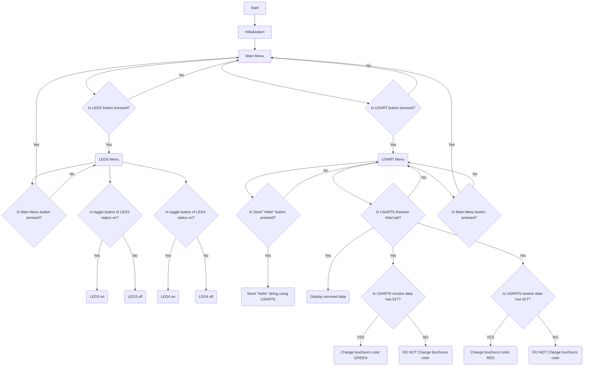

# STM32F469I-DISCO-LFT-SCREEN

## Content of Project

The subject of this project is to develop a software that controls led states using various functions and provides communication using various communication protocols. In addition, it is to make a design that will show these situations on the TFT screen.

- The functions to be used to change the states of the LEDs are respectively: **GPIO TOGGLE**

- The communication protocols used are respectively: **USART**, **Can BUS**
	> USART and Can BUS communication protocols are bilateral.

## Release Note

Details about the content of this release are available in the release note [here](https://github.com/lifternarge/STM32F469I-DISCO-LFT-SCREEN/blob/v.1.0/Release_Notes.html).

## The Board Used in The Project

This project used **STM32F469I-DISCO** board.

## Pinouts

- USART pinouts: **PC6**, **PC7**
	> PC6 --> USART6 **TX**
	
	> PC7 --> USART6 **RX**

## Flowchart of Project

